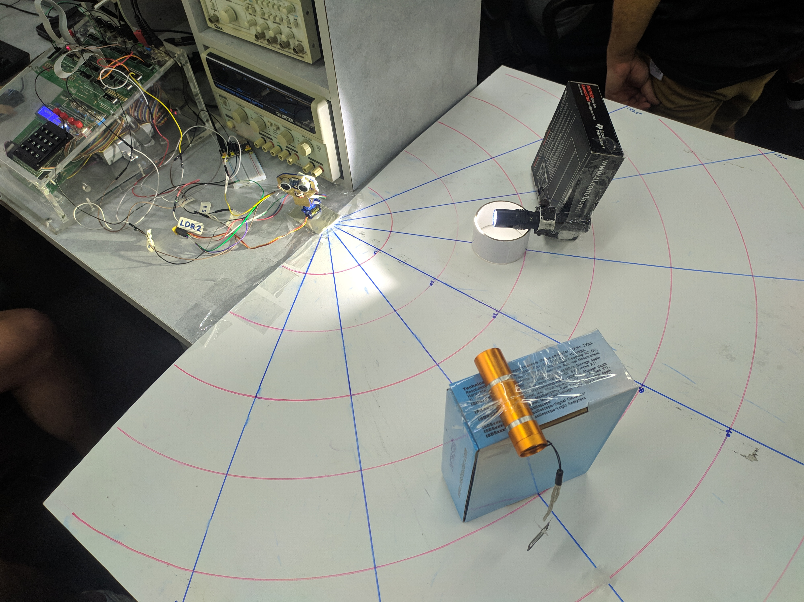
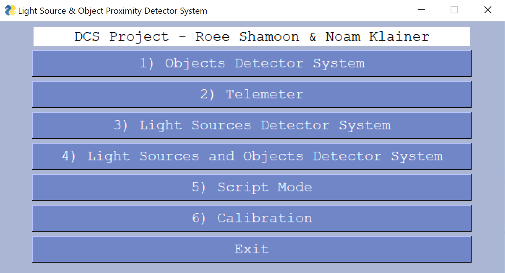
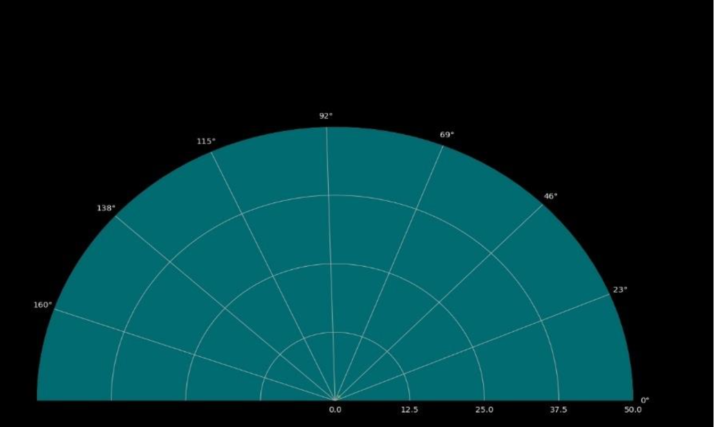
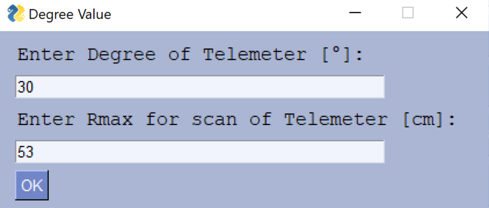
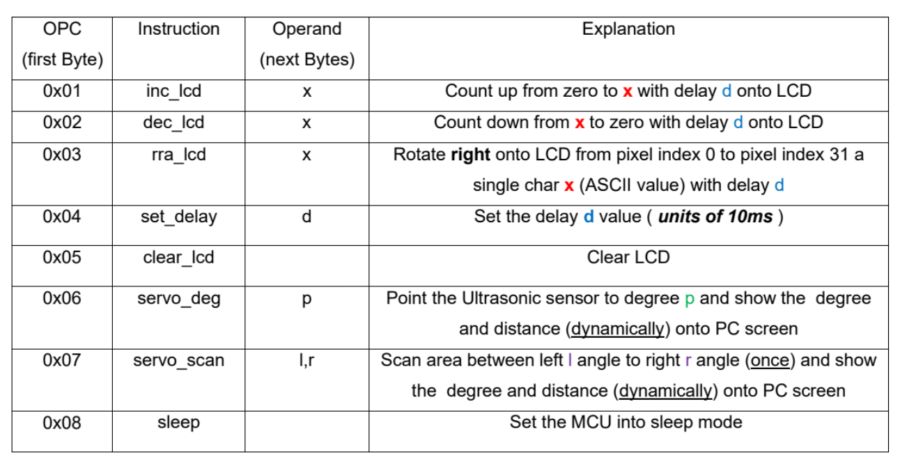
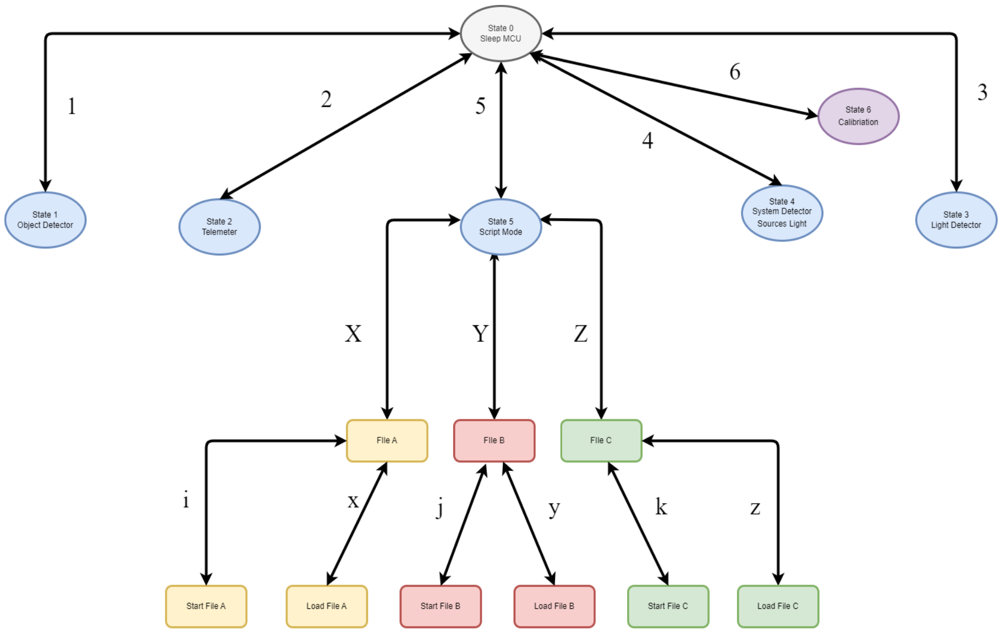
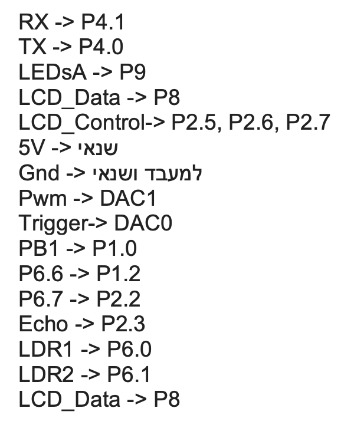

# Light Sources and Objects Detector System

## Target of the project 
 The purpose of the project is to implement, design and demonstrate an embedded system based on the MCU - PC and capable of detecting light sources and tracking objects in space 
 using a number of components such as the ultrasonic distance meter, LDR light sensors and a servo motor. The main goal is to create a scanning mechanism that covers an area 
 of 180 degrees to collect data from the surrounding environment just like radar.
 This innovative system can use for applications in civilian and military security systems, environmental monitoring and various other scenarios requiring essential light sources 
 detection and object monitoring.

## Features

The system consists of three main components:

- Distance sensor: An Ultrasonic Sensor distance sensor is used to measure the distance between the Servo motor handle and the light source.
- Light sensors: Two LDR light sensors are located on the sides of the distance sensor. These sensors are used to detect the location of the light source.
- Servo motor: A Servo motor is used to rotate the light and distance sensors in a 180-degree range.

The system operates as follows:

1. The Servo motor rotates the light and distance sensors in a 180-degree range.
2. The distance sensor measures the distance between the Servo motor handle and the light or object source at each position.
3. The distance and location data of the light sources are sent to the microcontroller.
4. The microcontroller processes the data and displays the location and distance results of the light sources on the PC screen through the user interface.

#### Light source detection:
 We developed a reliable method for detecting light sources within the scanning area using the LDR light sensors. The system should be able to differentiate 
 between different light intensities and accurately determine the positions of the light sources, by calibration to be carried out in advance.

#### Monitoring:
 Which determines precise control of the angular movement of the servo motor using a PWM signal from the MCU. The servo motor should be able to detect the intended area of 180 
 degrees in continuous motion. and accurate

#### Data processing:
 Development of algorithms for processing the data collected from the ultrasonic distance meter and the LDR sensors. By processing the sensor data to create a comprehensive 
 understanding of the environment, that is, identifying the distance of objects and light sources.

#### Computer GUI user interface to design:
 An intuitive user interface with the mouse to select the mode desired by the user and in addition we will present the results of the scan in time. In addition, the interface will 
 display relevant information regarding the distance from detected light beams and object distances by the Matplotlib book and Numpy.

#### Precision Calibration: 
 Ensuring the accuracy and reliability of the system by calibrating the sensors and servo motor to reduce measurement errors leads to improved performance.

#### Mobility:
 Mobility to create a compact system that can be easily deployed and installed in different environments for monitoring and data collection applications.

## Project modes:

This project is divided into several work modes, each mode will work independently from the other modes and at the end of the GUI mode

## Objects Detector System Mode

The implementation of the Objects Detector System will dynamically monitor objects in space at a defined distance through a user interface 180 by performing only one scan within a scan scope of degrees and at an optimal level of accuracy, it uses a combination of a Serbo engine for scanning - and an ultra rangefinder. Sonic, the system receives a distance to mask, scans by the user's choice and a section of 180 degrees to identify and measure distances to moving objects. In the angular environment of a servo motor it is controlled by means of a Pulse Width Modulation (PWM) signal, the angle is controlled in particular by Duty Cycle The percentage determined with the help of the timer. Collected data undergoes an information processing process on the PC side to create a comprehensive understanding of the environment, providing information in real time of the distance objects.

When we identify objects in vertical space, we place them in the diagram according to their distance and angle

## Telmeter System Mode

Position the servo motor at the angle given to be selected through the user interface and display the distance measured from the distance sensor dynamically and in real time with a resolution of cm

## System Detector Light Sources

Implementation of a Dynamic Light Source Detection System to monitor light sources in space within a range of up to half a meter with a single scan in a 180-degree scanning range and optimal accuracy.

## Script Mode 
Scripts activation of the entire system according to the file containing predefined Level High commands. The system can be operated automatically and all parts of the system can be tested. It is required to support the ability to send and receive up to three files and choose to run one of them separately and independently of the selection from the menu on the computer side. Only the supported commands:

Selecting a command script file containing the commands indicated above

Choosing to load the flash or activate it:

## Finite State Machine

### Configuration

## Authors

- Roee Shahmoon
- Noam Klainer 
